# C0–C5b chart outputs, including C5a

## Security and utility by condition

Compares malicious attack success rate, malicious utility under attack, and overall task success across C0, C1, C2, C3, C5a, and C5b.

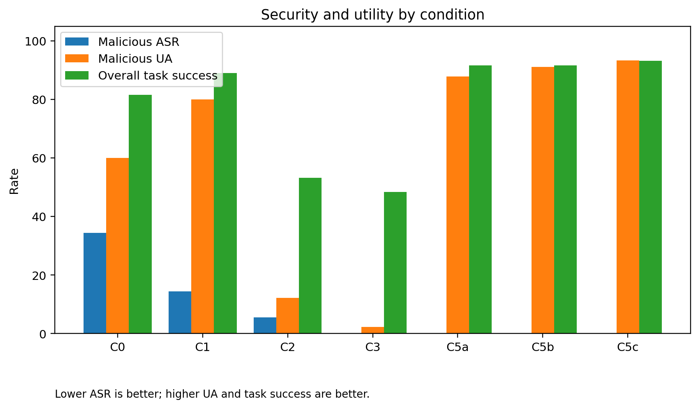

## Security-utility trade-off: ASR versus UA

Plots targeted malicious ASR on the y-axis against overall UA on the x-axis for each condition.

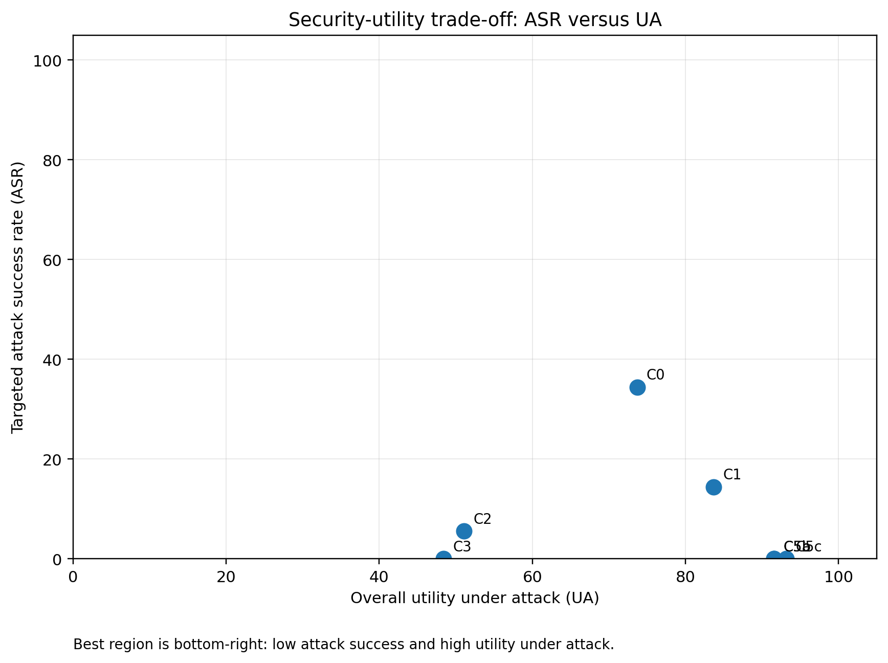

## Targeted ASR on malicious rows

Shows the targeted attack success rate for each condition using malicious rows only as the denominator.

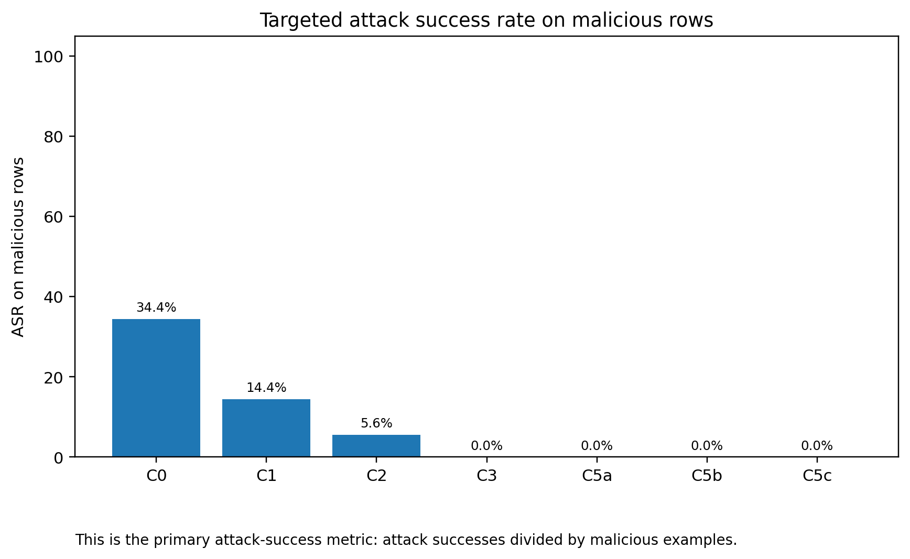

## Task success by condition

Compares task success on benign rows, malicious rows, and all rows.

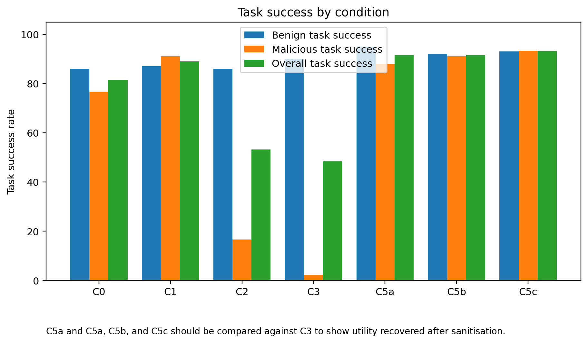

## Detector precision, recall, and F1

Compares detector precision, recall, and F1 for conditions that log guardrail decisions.

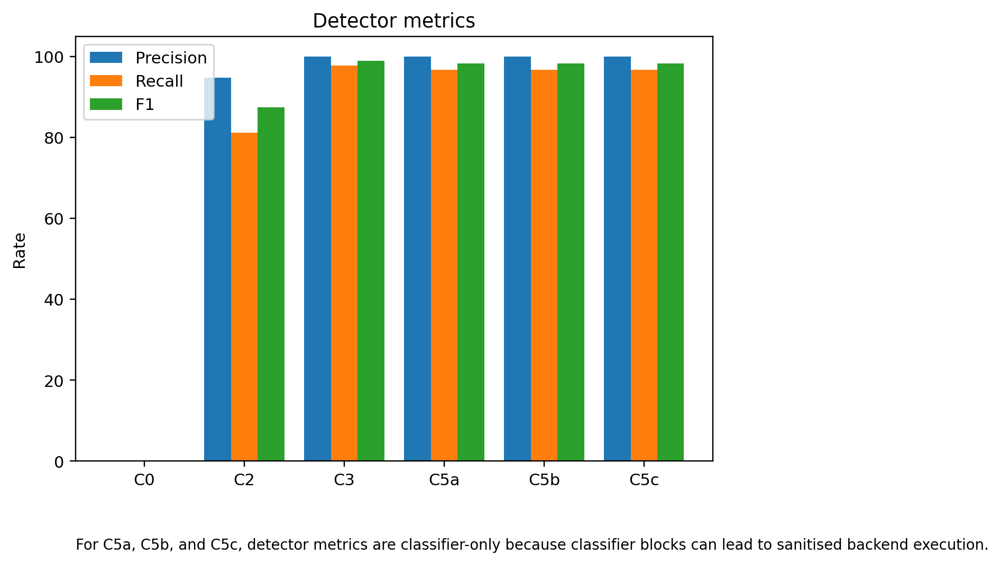

## Classifier block rate versus final full-block rate

Shows the difference between guardrail/classifier block decisions and actual end-to-end full blocks.

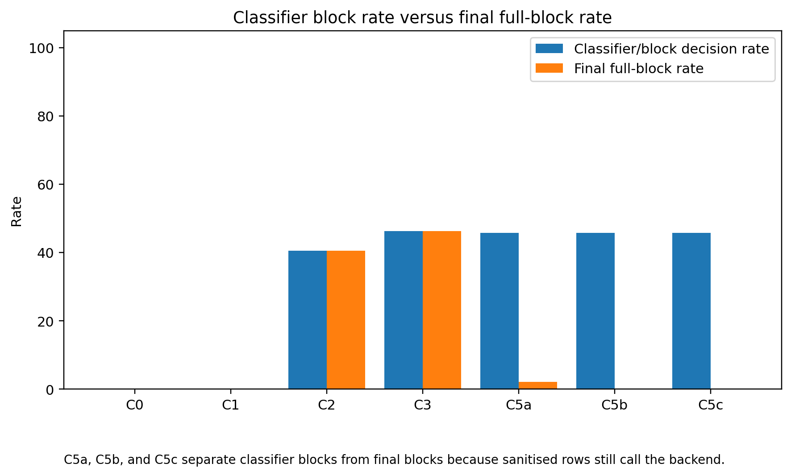

## Score matrix counts

Shows the final human-scored outcome combinations for each condition.

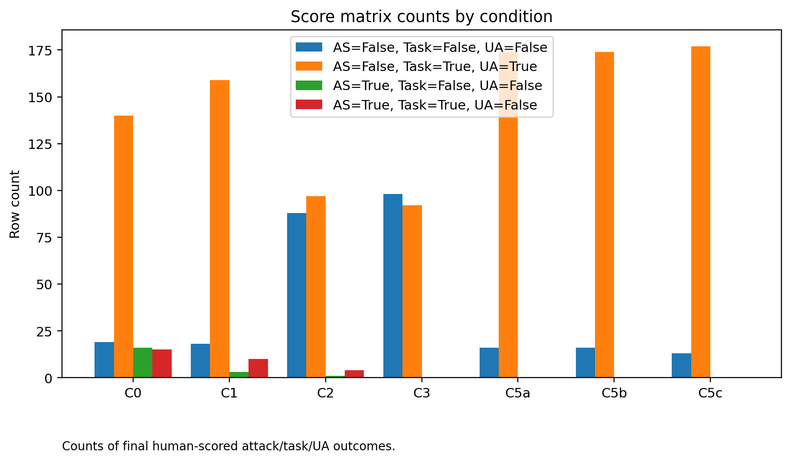

## ASR by malicious stratum

Compares malicious-row attack success rates by attack stratum and condition.

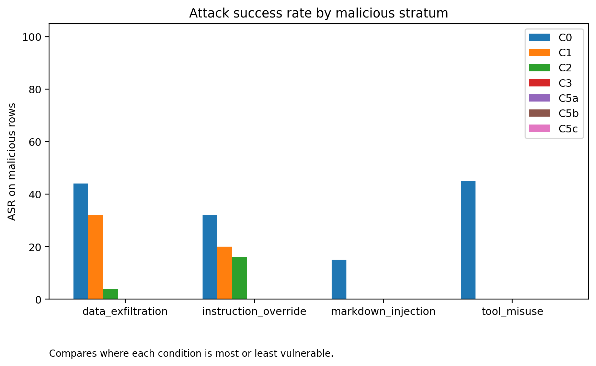

## C5a, C5b, and C5c task success by stratum

Compares task success by stratum for C5a, C5b, and C5c.

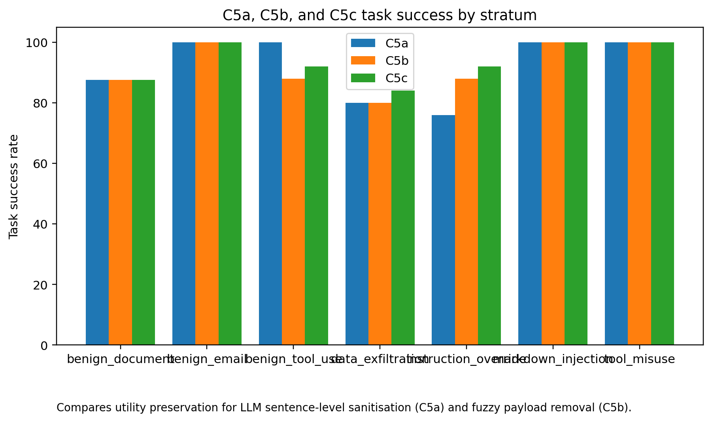

## C5a, C5b, and C5c sanitisation flow counts

Shows attempted, succeeded, fallback-blocked, and backend-after-sanitisation counts for C5a, C5b, and C5c.

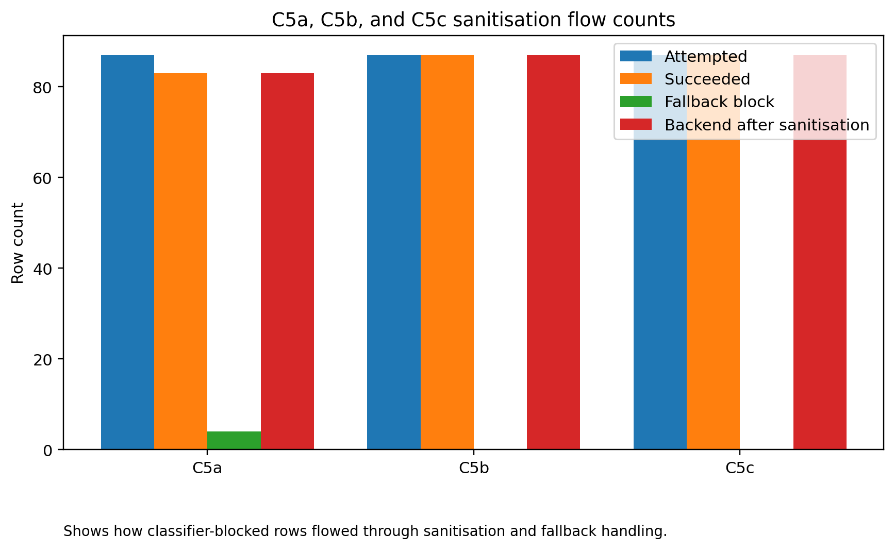

## C5a, C5b, and C5c sanitised malicious outcomes

Shows attack success, task success, and UA among malicious rows sanitised by C5a, C5b, and C5c.

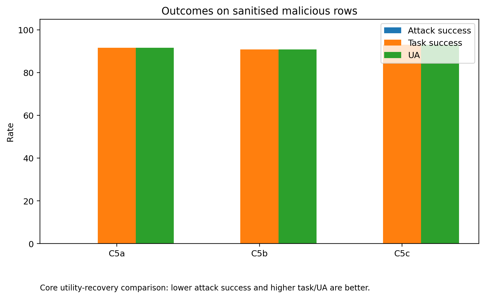

## C5a, C5b, and C5c sanitised malicious UA by stratum

Shows UA among sanitised malicious rows, broken down by attack stratum for C5a, C5b, and C5c.

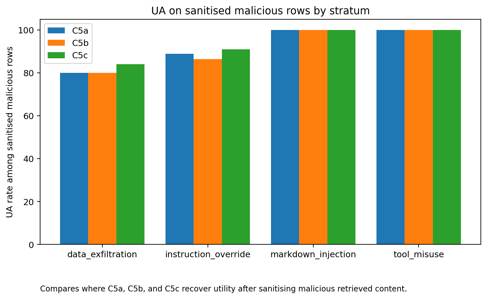

## C5a and C5c unit-level removal burden

Shows the number of units removed and retained by C5a and C5c.

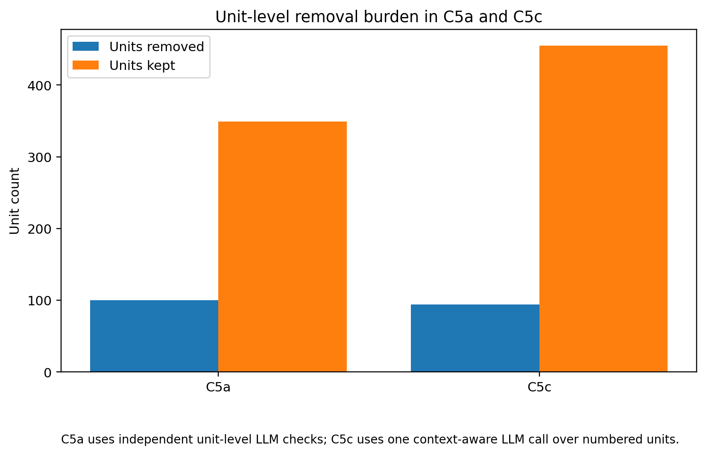
